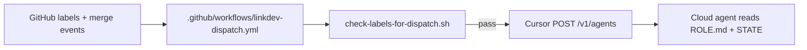

# LiNKdev dispatch v2

Version: 2.0  
Status: active (2026-05-31)

**Dispatch** is how factory roles (Orchestrator, Executor, Reviewer, Integrator) start **Cursor Cloud Agents** without Cursor Automations UI. GitHub labels and `STATE.md` remain the coordination layer; GitHub Actions listens for label and merge events, verifies **AND** label rules with `gh`, then calls the [Cursor Cloud Agents API](https://cursor.com/docs/cloud-agent/api/endpoints).

Codex executor dispatch (`runtime:codex`) is **future-only** in v1 — not implemented in `linkdev-dispatch.yml`.

## Architecture



| Layer | Owns |
|-------|------|
| GitHub | Labels, issues, PRs, merge to `development` |
| `LiNKdev/factory/STATE.md` | Active wave (Orchestrator writes) |
| GitHub Actions | Trigger matrix, AND label checks, API dispatch |
| Cursor Cloud Agents | Role execution from `factory/prompts/*/ROLE.md` |
| Cursor Automations UI | **Deprecated** — optional legacy; see [../install/automations/README.md](../install/automations/README.md) |

## Trigger matrix

| Role | GitHub event | Label / condition | Dispatch script role |
|------|----------------|-------------------|----------------------|
| **Executor** (Cursor) | `issues` → `labeled` | **Both** `linkdev:ready` **and** `runtime:cursor` on same issue | `executor` |
| **Reviewer** | `pull_request` → `labeled` | `linkdev:review-ready` on PR | `reviewer` |
| **Integrator** | `pull_request` → `labeled` | `linkdev:merge-ready` on PR | `integrator` |
| **Orchestrator** | `pull_request` → `closed` (merged) | Base branch `development` | `orchestrator` |
| **Orchestrator** (manual) | `workflow_dispatch` | Input role = `orchestrator` | `orchestrator` |

Cursor Automations cannot express **AND** label logic on issues; Actions run `check-labels-for-dispatch.sh` on every candidate `labeled` event and no-op unless all required labels are present.

## Workflow install (wire)

Template stubs live under `LiNKdev/factory/install/github/`:

| Template file | Installed path |
|---------------|----------------|
| `linkdev-dispatch.yml` | `.github/workflows/linkdev-dispatch.yml` |
| `linkdev-guard.yml` | `.github/workflows/linkdev-guard.yml` |
| `branch-source-policy.yml` | `.github/workflows/branch-source-policy.yml` |

During wire Step A ([../install/EXECUTE-WIRE-LINKDEV.md](../install/EXECUTE-WIRE-LINKDEV.md)):

```bash
mkdir -p .github/workflows
cp LiNKdev/factory/install/github/linkdev-dispatch.yml .github/workflows/
cp LiNKdev/factory/install/github/linkdev-guard.yml .github/workflows/
cp LiNKdev/factory/install/github/branch-source-policy.yml .github/workflows/
git add .github/workflows/
```

`LiNKdev/factory/scripts/verify.sh` checks that template workflow files exist and that dispatch helper scripts are executable.

## Secrets (per product repo)

Configure in **GitHub → Settings → Secrets and variables → Actions** on each wired repository:

| Secret | Required | Purpose |
|--------|----------|---------|
| `CURSOR_API_KEY` | **Yes** for dispatch | Cursor Dashboard → API Keys (user or service account). Passed to `dispatch-cursor-agent.mjs` as Basic auth. |
| `GITHUB_TOKEN` | Default (Actions) | `gh` label checks and API context; use built-in `GITHUB_TOKEN` with `permissions` in workflow. |

Never commit API keys. Do not store `CURSOR_API_KEY` in `LiNKdev/` or `.env` in git.

## Scripts

| Script | Purpose |
|--------|---------|
| [../scripts/check-labels-for-dispatch.sh](../scripts/check-labels-for-dispatch.sh) | `gh`-based AND label checks for issues and PRs |
| [../scripts/dispatch-cursor-agent.mjs](../scripts/dispatch-cursor-agent.mjs) | Build prompt from `ROLE.md`; `POST https://api.cursor.com/v1/agents` |

### Local dry-run (no API call)

```bash
export CURSOR_API_KEY=   # unset to skip API
node LiNKdev/factory/scripts/dispatch-cursor-agent.mjs --role orchestrator --dry-run
```

### Manual dispatch

```bash
export CURSOR_API_KEY="$(gh secret get CURSOR_API_KEY)"  # or from secure store
node LiNKdev/factory/scripts/dispatch-cursor-agent.mjs \
  --role executor --repo linktrend/LiNKtrend-System --issue 42
```

## Proof of wire (Step C)

After `CURSOR_API_KEY` is set and workflows are on `development`:

1. Run [../install/EXECUTE-WIRE-LINKDEV-POST-DISPATCH.md](../install/EXECUTE-WIRE-LINKDEV-POST-DISPATCH.md).
2. Apply `linkdev:ready` + `runtime:cursor` to a dry-run test issue.
3. Confirm **Actions** run **LiNKdev dispatch** succeeded and Cursor shows a new agent run.
4. Record evidence in `LiNKdev/product/reports/wire/WIRE-SESSION.md`.

## Codex (future)

| Label pair | v1 dispatch |
|------------|-------------|
| `linkdev:ready` + `runtime:cursor` | GitHub Actions → Cursor API |
| `linkdev:ready` + `runtime:codex` | Not automated — manual Codex session or future workflow |

## Sync from template repo

`scripts/sync-installations.sh` updates `LiNKdev/factory/` and portable `.cursor/` commands; it does **not** auto-copy `.github/workflows/`. After each template tag, run wire copy step on each installation or add workflows in a one-time PR per repo.

See [../../../docs/SYNC-INSTALLATIONS.md](../../../docs/SYNC-INSTALLATIONS.md).

## Deprecated paths

| Path | Replacement |
|------|-------------|
| [../install/EXECUTE-LINKDEV-UI-AUTOMATIONS.md](../install/EXECUTE-LINKDEV-UI-AUTOMATIONS.md) | [EXECUTE-LINKDEV-DISPATCH-INSTALL.md](../install/EXECUTE-LINKDEV-DISPATCH-INSTALL.md) |
| [../install/EXECUTE-WIRE-LINKDEV-POST-UI.md](../install/EXECUTE-WIRE-LINKDEV-POST-UI.md) | [EXECUTE-WIRE-LINKDEV-POST-DISPATCH.md](../install/EXECUTE-WIRE-LINKDEV-POST-DISPATCH.md) |
| [../install/automations/CURSOR-CREATE-AUTOMATIONS.md](../install/automations/CURSOR-CREATE-AUTOMATIONS.md) | This document |
