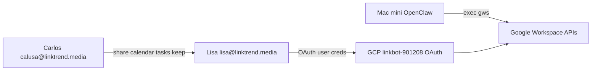

# gws Integration Plan — Lisa Prime

**Date:** 2026-07-10
**Status:** Decisions locked. **Path A** complete for client + consent. **Lisa OAuth done (2026-07-10).** **Remaining:** GCP IAM `serviceusage.serviceUsageConsumer` for Lisa principal on `linkbot-901208`, Keep scope re-auth if needed, Carlos sharing, full green smokes.

## Goal

Lisa (`lisa@linktrend.media`) manages Google Workspace via the open-source **`gws`** CLI — JSON output, agent-friendly. Carlos shares his calendar, Tasks lists, and Keep notes **to** Lisa; Lisa never uses Carlos's Google login.

## Locked decisions (2026-07-10 — Carlos approved)

| #   | Decision                            | Verdict                                                                                                                                                                                           |
| --- | ----------------------------------- | ------------------------------------------------------------------------------------------------------------------------------------------------------------------------------------------------- |
| 1   | Lisa's permanent Workspace identity | **`lisa@linktrend.media`** — not a throwaway alias                                                                                                                                                |
| 2   | GCP OAuth project                   | **Reuse `linkbot-901208`** (Calendar API already enabled; SA `lisa-linkbot@...` stays for Secret Manager only — not gws)                                                                          |
| 3   | Gmail                               | **Yes** — Lisa sends mail **as herself**. **Restriction:** recipients must be `@linktrend.media` only until Carlos lifts the boundary                                                             |
| 4   | Carlos resource access              | **Read/write** — Lisa may add/edit events on Carlos's shared calendar, tasks on shared Tasks lists, notes on shared Keep items. Carlos shares access; Lisa uses **her own** OAuth credentials     |
| 5   | Tenant timing                       | **Auth now on current HK tenant.** US migration later = config re-auth update, not a redesign                                                                                                     |
| 6   | **GCP project admin (Path A)**      | **`info@linktrend.media`** — Owner on `linkbot-901208` for Service Usage + OAuth client/consent. **Path B rejected:** grant `calusa@` Editor instead. Workspace admin (`calusa@`) = sharing only. |

## Architecture

### Auth model (OAuth user, not service account)

| Approach                                 | Verdict                 | Why                                                                          |
| ---------------------------------------- | ----------------------- | ---------------------------------------------------------------------------- |
| **OAuth as `lisa@linktrend.media`**      | **Chosen**              | Permanent Lisa identity; calendar/tasks/keep via share ACL; least privilege. |
| Service account + domain-wide delegation | Rejected                | Impersonates users; admin-heavy; violates share-not-delegate intent.         |
| Carlos's OAuth creds on Mac mini         | Rejected                | Lisa would act as Carlos; no security boundary.                              |
| `GOOGLE_WORKSPACE_CLI_TOKEN` from gcloud | Rejected for production | Short-lived; tied to whoever ran gcloud (Carlos).                            |

**Headless fallback (later):** after interactive `gws auth login`, `gws auth export` → `GOOGLE_WORKSPACE_CLI_CREDENTIALS_FILE` in `.env` for gateway restarts without browser. Not required for initial setup.

### Sharing model (Carlos → Lisa)

| Resource     | Carlos action                                                                     | Lisa access                                                        |
| ------------ | --------------------------------------------------------------------------------- | ------------------------------------------------------------------ |
| **Calendar** | Calendar → Settings → Share → `lisa@linktrend.media` → **Make changes to events** | Read/write via shared `calendarId` (e.g. `calusa@linktrend.media`) |
| **Tasks**    | Tasks app → open list → Share → add `lisa@linktrend.media` → **Edit**             | Create/complete tasks on shared lists                              |
| **Keep**     | Open note → Collaborator → add `lisa@linktrend.media` → **Edit**                  | Add/edit shared notes                                              |
| **Drive**    | Per-file/folder share as needed                                                   | No blanket Carlos Drive access                                     |

1. Lisa: `gws calendar calendarList list` — shared calendar appears with `accessRole` ≥ `writer`.
2. Mutations target explicit `calendarId` (e.g. `calusa@linktrend.media`), not `primary` (Lisa's own calendar).

**Not used:** Calendar/Gmail delegation in the admin sense. Share ACL is sufficient.

### Security boundaries

| Asset                             | Lisa access                    | Mechanism                                                      |
| --------------------------------- | ------------------------------ | -------------------------------------------------------------- |
| Lisa Drive / Tasks / Keep / Gmail | Full (her account)             | OAuth as Lisa                                                  |
| Carlos primary calendar           | Read/write events              | Share to Lisa                                                  |
| Carlos Tasks lists                | Read/write (shared lists only) | Share to Lisa                                                  |
| Carlos Keep notes                 | Read/write (shared notes only) | Collaborator share                                             |
| Lisa outbound email               | Send as Lisa                   | **Recipients: `@linktrend.media` only** (personality-enforced) |
| Carlos Gmail / Drive              | None unless explicitly shared  | Per-item ACL                                                   |
| Admin / user management           | None                           | No admin scopes                                                |

Lisa **must ask Carlos** before: sending email outside `@linktrend.media`, deleting data, external sharing, Admin API.

## What lives where

| Content                       | Location                                         |
| ----------------------------- | ------------------------------------------------ |
| Lisa runtime rules (injected) | `Personality files/TOOLS.md` § gws               |
| Email boundary (injected)     | `Personality files/AGENTS.md` § Google Workspace |
| Carlos setup steps            | `LISA_CONTROL_CHEATSHEET.md` § Google Workspace  |
| Architecture + decisions      | This file (`audit/05-gws-integration-plan.md`)   |
| Env var stubs                 | `~/.openclaw-lisa/.env.example`                  |
| Live secrets                  | `~/.openclaw-lisa/.env` (gitignored)             |
| OAuth tokens (default)        | `~/.config/gws/` (encrypted)                     |

**Do not** put OAuth secrets in personality files or repo.

## Implementation status

### Done (2026-07-10)

- [x] `gws` v0.22.5 installed via Homebrew on Mac mini
- [x] Decisions locked (identity, GCP project, gmail scope, read/write sharing, HK tenant)
- [x] `TOOLS.md` — Lisa usage rules, scopes incl. gmail, email boundary, sharing model
- [x] `AGENTS.md` — email boundary rule
- [x] `LISA_CONTROL_CHEATSHEET.md` — operator checklist
- [x] `.env.example` — gws variable stubs
- [x] This integration plan
- [x] Sync personality files to live workspace

### Carlos manual (blocking)

- [x] `gcloud auth login` + project `linkbot-901208` on Mac mini — **`info@linktrend.media` active** — **2026-07-10 Path A run**
- [x] GCP APIs (calendar, tasks, drive, gmail, keep, sheets, pubsub) on `linkbot-901208` — **enabled via `info@` 2026-07-10**
- [x] Desktop OAuth client (`~/.config/gws/client_secret.json`) — **Done** 2026-07-10
- [x] GCP OAuth consent: add `lisa@linktrend.media` as **test user** — **Done** 2026-07-10 (Lisa login succeeded)
- [x] Browser OAuth login as `lisa@linktrend.media`: `gws auth login -s calendar,tasks,drive,keep,gmail` — **Done** 2026-07-10
- [ ] Share Carlos calendar to Lisa (**Make changes to events**)
- [ ] Share Carlos Tasks list(s) to Lisa (**Edit**)
- [ ] Share Carlos Keep note(s) to Lisa (**Edit** collaborator)
- [ ] Smoke tests (see cheatsheet) — **Partial** 2026-07-10 (calendar agenda pass; tasks/gmail IAM; Keep scope)

### Optional follow-ups

- [ ] Install gws agent skills: `npx skills add https://github.com/googleworkspace/cli/tree/main/skills/gws-calendar` (and drive/tasks) into `~/.openclaw-lisa/workspace/skills/`
- [ ] `gws auth export` for headless credential file in `.env`
- [ ] US Workspace migration — re-auth `gws auth login` after tenant cutover
- [ ] Lift `@linktrend.media`-only email restriction when Carlos approves external recipients

## Existing infrastructure (Google Migration)

- Workspace user **`lisa@linktrend.media`** — active, low mailbox usage, flagged Critical in migration audit (automation identity). **Confirmed permanent Lisa identity.**
- GCP project **`linkbot-901208`** — `calendar-json.googleapis.com` enabled; SA `lisa-linkbot@...` exists for **Secret Manager**, not for gws user OAuth. **Confirmed OAuth project.**
- Carlos user **`calusa@linktrend.media`** (calendar share target).

## OpenClaw runtime notes

- `openclaw.json`: `tools.profile: coding`, `sandbox.mode: off` — Lisa runs `gws` on host via `exec`.
- `start-lisa.sh` PATH includes Homebrew — `gws` resolves at `/opt/homebrew/bin/gws`.
- No `openclaw.json` change required for Phase 0.

## Troubleshooting

| Symptom                   | Fix                                                                      |
| ------------------------- | ------------------------------------------------------------------------ |
| Exit code 2 / auth error  | Run `gws auth login` as Lisa; check test user in OAuth consent           |
| Access blocked            | Add `lisa@linktrend.media` as OAuth test user                            |
| Too many scopes           | Use `-s calendar,tasks,drive,keep,gmail` not `recommended`               |
| `accessNotConfigured`     | Enable API in GCP; retry after ~10s                                      |
| Carlos calendar missing   | Carlos must share to Lisa; Lisa runs `calendarList list`                 |
| Carlos tasks/keep missing | Carlos must share specific list/note to Lisa                             |
| `redirect_uri_mismatch`   | OAuth client must be **Desktop app** type                                |
| Email to external domain  | Blocked by policy — ask Carlos before sending outside `@linktrend.media` |

## References

- https://github.com/googleworkspace/cli
- `Google Migration/03-briefing/GOOGLE_MIGRATION_MASTER_BRIEFING_AND_MANUAL.md`
- `Google Migration/01-current-audit/google-workspace-hk-to-us-migration-audit-2026-07-07.md`

## Progress log — 2026-07-10 (automation pass, Mac mini)

**Authorized by Carlos:** full automation attempt for gcloud + Workspace admin setup.

### Executed

| Step                           | Result                                                                                                                                                                  |
| ------------------------------ | ----------------------------------------------------------------------------------------------------------------------------------------------------------------------- |
| `gcloud auth list`             | `info@linktrend.media` (active, **token refresh failed**); `linktrend-aios-prod-gcp-sa@linkbot-901208.iam.gserviceaccount.com` (**works** for token + project describe) |
| `gcloud config` project        | Already `linkbot-901208`; `gcloud config set project` fails on `info@` until re-login                                                                                   |
| `gws auth status`              | `auth_method: none`; `client_secret.json` **missing**                                                                                                                   |
| `gws auth setup --dry-run`     | SA auth OK; would enable 22 APIs incl. `keep.googleapis.com`                                                                                                            |
| `gws auth setup` (live, SA)    | **All API enables PERMISSION_DENIED**; OAuth client step requires **Cloud Console** (gws validation error)                                                              |
| `gws auth setup` (live, info@) | **Failed** — cannot set project (expired user creds)                                                                                                                    |
| Secret Manager scan            | No stored Desktop OAuth JSON for gws; unrelated OIDC/Slack secrets only                                                                                                 |
| Workspace Admin SDK / GAM      | **Not available** on host (`gam` absent; no admin user gcloud session)                                                                                                  |
| Migration audit cross-check    | `lisa@linktrend.media` **Active**, Critical identity; `calendar-json.googleapis.com` listed in audit                                                                    |

### Not completed (blockers)

1. **Interactive `gcloud auth login`** for a human principal with `serviceusage.services.enable` + OAuth client admin on `linkbot-901208`.
2. **OAuth consent test user** `lisa@linktrend.media` (Console only).
3. **`~/.config/gws/client_secret.json`** install.
4. **`gws auth login -s calendar,tasks,drive,keep,gmail`** — browser OAuth **must be completed signed in as Lisa** (Carlos or Lisa credentials on Mac mini).
5. **Carlos → Lisa sharing** for calendar, Tasks, Keep (UI).

### Exact next step for Carlos

1. `gcloud auth login` → `gcloud config set project linkbot-901208` → `gws auth setup --project linkbot-901208`
2. Consent screen: test user `lisa@linktrend.media`
3. Browser as Lisa: `gws auth login -s calendar,tasks,drive,keep,gmail`
4. As `calusa@`: share calendar (make changes), Tasks lists (Edit), Keep notes (Edit collaborator)
5. Run smoke tests in `LISA_CONTROL_CHEATSHEET.md` §6

**Keep API note:** `keep.googleapis.com` is in the gws setup API bundle; enabling may still be limited by Google product policy — verify with `gws keep notes list` after login.

## Progress log — 2026-07-10 (post Carlos "gcloud done" verification)

**Context:** Carlos reported `gcloud auth login` complete on Mac mini. Agent re-ran read-only checks + one `gws auth setup` attempt (no token writes).

### Verification matrix

| Check                                     | Result                                                                                                                                                                     |
| ----------------------------------------- | -------------------------------------------------------------------------------------------------------------------------------------------------------------------------- |
| `gcloud auth list`                        | **PASS** — active `calusa@linktrend.media`; also `info@linktrend.media`, SA `linktrend-aios-prod-gcp-sa@linkbot-901208.iam.gserviceaccount.com`                            |
| `gcloud config get project`               | **PASS** — `linkbot-901208`                                                                                                                                                |
| `gws auth status`                         | **FAIL** — `auth_method: none`; no `client_secret.json`, `credentials.json`, or `credentials.enc`                                                                          |
| `ls ~/.config/gws/`                       | **PARTIAL** — dir exists; `cache/calendar_v3.json` only (API schema cache)                                                                                                 |
| `gws auth setup --project linkbot-901208` | **FAIL** — `calusa@`: PERMISSION_DENIED enabling APIs (calendar, gmail, drive, tasks, keep, …); OAuth client step requires **manual Cloud Console** (gws validation error) |
| `gcloud services list --enabled`          | **FAIL** — PERMISSION_DENIED for `calusa@`                                                                                                                                 |
| Smoke: calendar agenda                    | **SKIP** — no Lisa OAuth                                                                                                                                                   |
| Smoke: tasks list                         | **SKIP** — no Lisa OAuth                                                                                                                                                   |
| Smoke: keep notes list                    | **SKIP** — no Lisa OAuth                                                                                                                                                   |
| Smoke: gmail messages list                | **SKIP** — no Lisa OAuth                                                                                                                                                   |

### Interpretation

- **gcloud login ≠ gws ready.** Human gcloud session is present, but **Lisa gws OAuth pipeline is not started** (no Desktop client file, no tokens).
- **`calusa@linktrend.media` may not have Editor/Owner** on GCP project `linkbot-901208` for Service Usage / OAuth administration. Carlos needs either Console work signed in as a project admin, or `gcloud auth login` with that admin account before `gws auth setup` can enable APIs automatically.

### Updated next steps for Carlos (ordered)

1. **GCP (admin account):** Enable required APIs + create **Desktop** OAuth client → `~/.config/gws/client_secret.json` (via `gws auth setup` with privileged account, or Cloud Console download).
2. **OAuth consent:** Add test user `lisa@linktrend.media`.
3. **Lisa browser OAuth:** Sign in as `lisa@linktrend.media` → `gws auth login -s calendar,tasks,drive,keep,gmail` → confirm `gws auth status` shows stored credentials.
4. **Sharing (as `calusa@`):** Calendar (make changes), Tasks lists (Edit), Keep notes (Edit collaborator) — only needed after step 3 for Carlos-resource smoke tests.
5. **Smoke tests:** Run cheatsheet §6 commands.

**Not required for OAuth itself:** Calendar sharing is **not** a prerequisite for `gws auth login`; it is required for Lisa to see/edit Carlos's calendar via API after auth.

## Progress log — 2026-07-10 (Path A — Carlos decision)

**Decision:** Carlos chose **Path A** — use **`info@linktrend.media`** as GCP project **Owner** on **`linkbot-901208`** for Lisa `gws` setup (APIs, OAuth client, consent test users). **Path B** (grant `calusa@` Project Editor and use `calusa@` for gcloud) is **not** the plan.

### Agent verification (non-interactive, no `gcloud auth login`)

| Check                                                                    | Result                                                      |
| ------------------------------------------------------------------------ | ----------------------------------------------------------- |
| `gcloud auth list`                                                       | `info@linktrend.media` **listed** (alongside `calusa@`, SA) |
| `gcloud --account=info@linktrend.media projects describe linkbot-901208` | **PASS**                                                    |
| `gcloud --account=info@linktrend.media auth print-access-token`          | **PASS** (refresh without browser this session)             |
| Required APIs (calendar-json, tasks, drive, gmail, keep)                 | **ENABLED**                                                 |
| `~/.config/gws/client_secret.json`                                       | **Missing** — Console Desktop client still required         |
| `gws auth login` as Lisa                                                 | **Not started**                                             |

### Carlos checkpoint

After Path A Terminal block + Console (Desktop client + `lisa@` test user), Carlos replies **`info done`** — documented in `LISA_CONTROL_CHEATSHEET.md`.

### Remaining ordered work

1. Carlos: Path A Terminal + Console as `info@` → **`info done`**
2. Browser as `lisa@linktrend.media`: `gws auth login -s calendar,tasks,drive,keep,gmail`
3. Carlos as `calusa@`: share calendar, Tasks, Keep per sharing model
4. Smoke tests (cheatsheet §6)

## Progress log — 2026-07-10 (Path A end-to-end, Carlos: "You can do all of this")

**Agent run:** `info@linktrend.media` gcloud (Owner), `gws auth setup`, API enable, smoke prep.

### Completed

| Step                                            | Result                                                                                              |
| ----------------------------------------------- | --------------------------------------------------------------------------------------------------- |
| `gcloud auth list` / `config get-value project` | **PASS** — active `info@linktrend.media`; project `linkbot-901208`                                  |
| `gcloud auth print-access-token` (info@)        | **PASS**                                                                                            |
| `gcloud projects get-iam-policy` (info@)        | **PASS** — `roles/owner`                                                                            |
| Enable Workspace APIs                           | **PASS** — calendar-json, drive, gmail, tasks, keep, sheets, pubsub                                 |
| `gws auth setup --project linkbot-901208`       | **PARTIAL** — APIs OK; OAuth Desktop client step **Console-only** (gws upstream removed API create) |
| IAP brand                                       | **EXISTS** — `Lisa - LiNKbot`, support `info@linktrend.media`                                       |
| `gcloud iam oauth-clients` / IAP client create  | **Not usable** for gws Desktop installed-app flow                                                   |
| `clientauthconfig.googleapis.com` enable        | **FAIL** — AUTH_PERMISSION_DENIED (org/service policy); not a workaround for Desktop client         |

### Not completed

| Step                                                | Result                   |
| --------------------------------------------------- | ------------------------ |
| `~/.config/gws/client_secret.json`                  | **MISSING**              |
| OAuth consent test user `lisa@linktrend.media`      | **NOT DONE** (Console)   |
| `gws auth login -s calendar,tasks,drive,keep,gmail` | **NOT RUN** (no client)  |
| Smoke: calendar / tasks / keep / gmail              | **SKIP** — no Lisa OAuth |

### Smoke test results

All **SKIP** (no `client_secret.json`, `gws auth status` → `auth_method: none`).

### Minimal Carlos action

1. **info@ (one browser session):** Finish sign-in on GCP Credentials page (agent opened Chrome; currently **password challenge** for `info@`) → create **Desktop app** OAuth client → save JSON to `~/.config/gws/client_secret.json` → add **`lisa@linktrend.media`** as OAuth consent test user → reply **`info done`**.
2. **Lisa (one click after login):** Browser as **`lisa@linktrend.media`** → `gws auth login -s calendar,tasks,drive,keep,gmail` → **Allow**.

## Progress log — 2026-07-10 (Carlos: Lisa `gws auth login` done — verification)

**Agent verification** after Carlos reported Lisa OAuth complete.

### `gws auth status`

| Field                                                    | Result                            |
| -------------------------------------------------------- | --------------------------------- |
| `auth_method`                                            | **PASS** — `oauth2` (not `none`)  |
| `user`                                                   | **PASS** — `lisa@linktrend.media` |
| `client_config_exists`                                   | **PASS**                          |
| `encrypted_credentials_exists`                           | **PASS**                          |
| `encryption_valid` / `has_refresh_token` / `token_valid` | **PASS**                          |

### Smoke tests (cheatsheet §6)

| Command                                               | Result   | Notes                                                                                                                         |
| ----------------------------------------------------- | -------- | ----------------------------------------------------------------------------------------------------------------------------- |
| `gws calendar +agenda --today --timezone Asia/Taipei` | **PASS** | Exit 0; `count: 0` (no events today and/or Carlos calendar not shared yet)                                                    |
| `gws tasks tasklists list`                            | **FAIL** | 403 — caller needs `roles/serviceusage.serviceUsageConsumer` (or `serviceusage.services.use`) on project `linkbot-901208`     |
| `gws keep notes list`                                 | **FAIL** | 403 insufficient authentication scopes — granted scopes lack Keep; re-run `gws auth login -s calendar,tasks,drive,keep,gmail` |
| `gws gmail users messages list` (maxResults 3)        | **FAIL** | Same GCP IAM 403 as Tasks                                                                                                     |

### Interpretation

- **Carlos claim verified:** Lisa OAuth login is **real** — tokens stored, method `oauth2`.
- **Not fully operational:** Most Workspace API calls still blocked until **`lisa@linktrend.media`** (or the OAuth client’s usage principal) has **Service Usage Consumer** on `linkbot-901208` via [IAM](https://console.developers.google.com/iam-admin/iam?project=linkbot-901208) as `info@`.
- **Keep:** Token issued without Keep scope in effective grant — scope picker re-auth with `keep` in `-s`.
- **Carlos sharing:** Still required for Lisa to see/edit **Carlos** calendar, Tasks lists, and Keep notes (§ sharing model). Lisa’s own mailbox/calendar work after IAM fix.

### Next steps (ordered)

1. **info@:** IAM → add `lisa@linktrend.media` → **Service Usage Consumer** on `linkbot-901208` (wait a few minutes for propagation).
2. **Lisa Terminal:** `gws auth login -s calendar,tasks,drive,keep,gmail` again if Keep scope still missing after IAM fix.
3. **calusa@:** Share calendar (make changes), Tasks lists (Edit), Keep notes (Edit collaborator).
4. Re-run cheatsheet §6 smokes until all pass.
